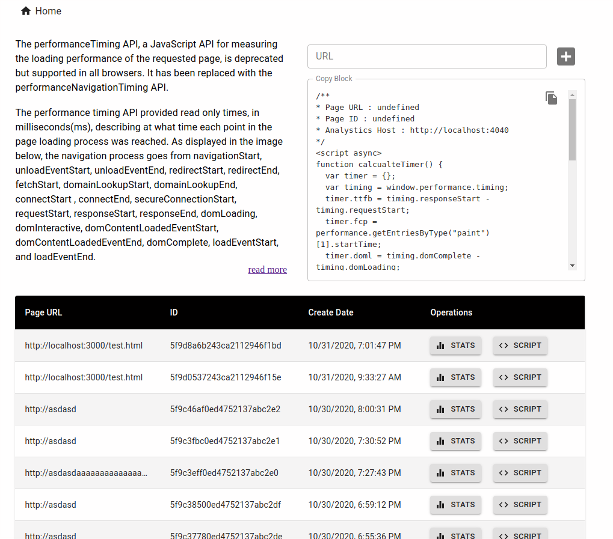

# Performance Analytics Front End

Projects built with Create-React-App include support for ES6 syntax, as well as several unofficial / not-yet-final forms of Javascript syntax such as Class Properties and JSX. See the list of [language features and polyfills supported by Create-React-App](https://github.com/facebookincubator/create-react-app/blob/master/packages/react-scripts/template/README.md#supported-language-features-and-polyfills) for more information.

# Script

```html
<!--
* Page URL : http://localhost:3000/test.html
* Page ID : 5f9e8bb5b238f965bb3de141
* Analystics Host : http://localhost:4040
-->
<script async>
  function calcualteTimer() {
    var timer = {}
    var timing = window.performance.timing
    timer.ttfb = timing.responseStart - timing.requestStart
    timer.fcp = performance.getEntriesByType('paint')[1].startTime
    timer.doml = timing.domComplete - timing.domLoading
    timer.wl = timing.loadEventEnd - timing.navigationStart
    timer.resources = performance.getEntriesByType('resource')
    return timer
  }

  function sendTimer() {
    var timer = calcualteTimer()
    var body = JSON.stringify(timer)
    fetch('http://localhost:4040/api/sites/5f9e8bb5b238f965bb3de141/metrics', {
      body,
      headers: {
        'Content-Type': 'application/json',
      },
      method: 'POST',
    })
  }

  window.addEventListener('load', function() {
    setTimeout(sendTimer, 0)
  })
</script>
```

# Screenshots




## Available Scripts

In the project directory, you can run:

### `npm start`

Runs the app in the development mode.<br>
Open [http://localhost:3000](http://localhost:3000) to view it in the browser.

The page will reload if you make edits.<br>
You will also see any lint errors in the console.

### `npm run build`

Builds the app for production to the `build` folder.<br>
It correctly bundles React in production mode and optimizes the build for the best performance.

The build is minified and the filenames include the hashes.<br>
Your app is ready to be deployed!

### `npm run eject`

**Note: this is a one-way operation. Once you `eject`, you can’t go back!**

If you aren’t satisfied with the build tool and configuration choices, you can `eject` at any time. This command will remove the single build dependency from your project.

Instead, it will copy all the configuration files and the transitive dependencies (Webpack, Babel, ESLint, etc) right into your project so you have full control over them. All of the commands except `eject` will still work, but they will point to the copied scripts so you can tweak them. At this point you’re on your own.

You don’t have to ever use `eject`. The curated feature set is suitable for small and middle deployments, and you shouldn’t feel obligated to use this feature. However we understand that this tool wouldn’t be useful if you couldn’t customize it when you are ready for it.
